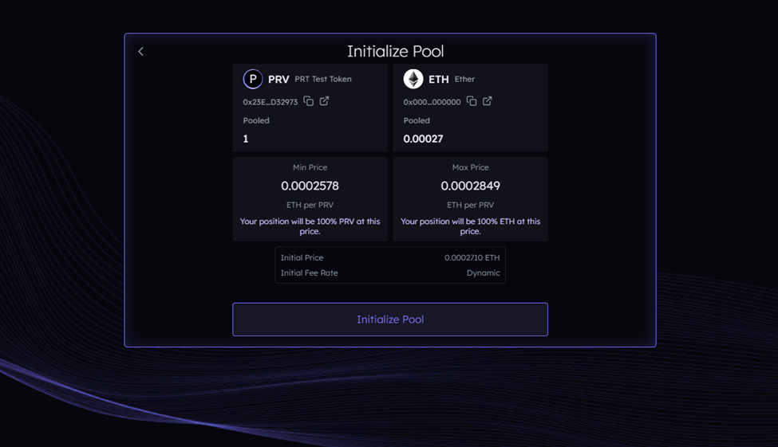
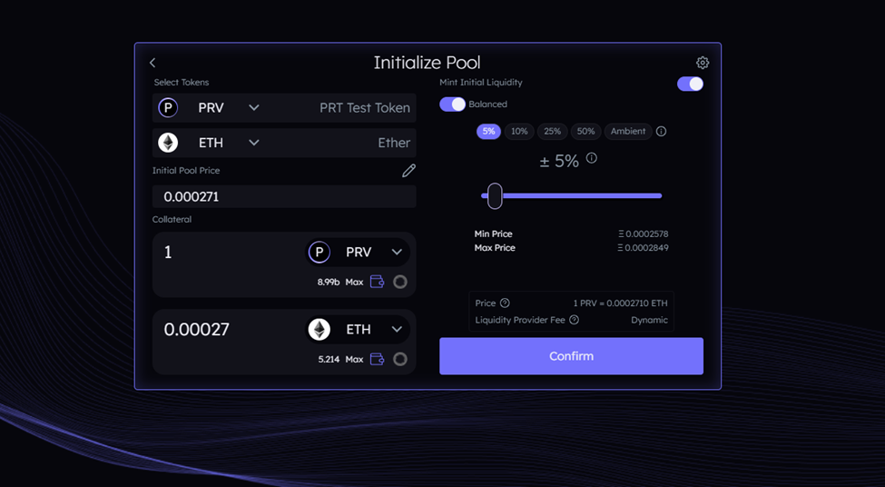
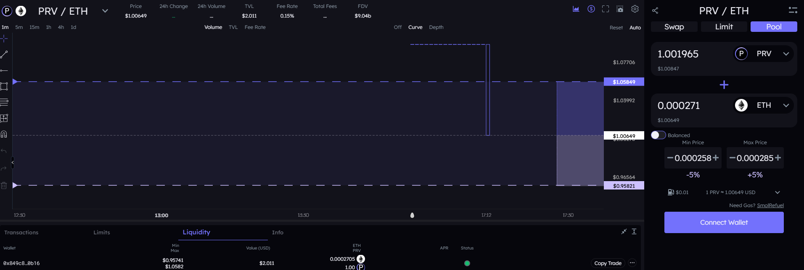

<h3>PRV/ETH</h3>
<h2>0x23Ee364499a965CeE8aE652C96edb62EEbD32973</h2>
<table>
  <tr>
    <td>
                <pre>
[
   {
    activeLiq: 0,
    cumAskLiq: 0,
    cumAverageUSD: NaN,
    cumBidLiq: 665468899014.7687,
    cumDeltaAsk: 0,
    cumDeltaBase: 270467879867705.1,
    cumDeltaQuote: NaN,
    deltaAverageUSD: NaN,
    deltaBase: 0,
    deltaQuote: NaN,
    lowerBound: -Infinity,
    lowerBoundInvPrice: Infinity,
    lowerBoundInvPriceDecimalCorrected: Infinity,
    lowerBoundPrice: 0,
    lowerBoundPriceDecimalCorrected: 0,
    upperBound: 193686,
    upperBoundInvPrice: 3.879220387508744e-9,
    upperBoundInvPriceDecimalCorrected: 3879.220387508744,
    upperBoundPrice: 257783755.5247036,
    upperBoundPriceDecimalCorrected: 0.0002577837555247036
},
    {
        "lowerBound": 193686,
        "lowerBoundPrice": 257783755.5247036,
        "lowerBoundInvPrice": 3.879220387508744e-9,
        "lowerBoundPriceDecimalCorrected": 0.0002577837555247036,
        "lowerBoundInvPriceDecimalCorrected": 3879.220387508744,
        "upperBound": 194186.00244134507,
        "upperBoundPrice": 271000000.0000001,
        "upperBoundInvPrice": 3.690036900369002e-9,
        "upperBoundPriceDecimalCorrected": 0.00027100000000000014,
        "upperBoundInvPriceDecimalCorrected": 3690.0369003690016,
        "activeLiq": 665468899014.7687,
        "cumBidLiq": 665468899014.7687,
        "cumAskLiq": 0,
        "deltaBase": 270467879867705.1,
        "deltaQuote": 1023300.7161390455,
        "deltaAverageUSD": 0.49968378966354715,
        "cumDeltaBase": 270467879867705.1,
        "cumDeltaAsk": 0,
        "cumDeltaQuote": 1023300.7161390455,
        "cumAverageUSD": 0.49968378966354715
    },
    {
        "lowerBound": 194186.00244134507,
        "lowerBoundPrice": 271000000.0000001,
        "lowerBoundInvPrice": 3.690036900369002e-9,
        "lowerBoundPriceDecimalCorrected": 0.00027100000000000014,
        "lowerBoundInvPriceDecimalCorrected": 3690.0369003690016,
        "upperBound": 194687,
        "upperBoundPrice": 284922174.74972975,
        "upperBoundInvPrice": 3.5097303355850805e-9,
        "upperBoundPriceDecimalCorrected": 0.0002849221747497297,
        "upperBoundInvPriceDecimalCorrected": 3509.730335585081,
        "activeLiq": 665468899014.7687,
        "cumBidLiq": 0,
        "cumAskLiq": 665468899014.7687,
        "deltaBase": -277873353597199.22,
        "deltaQuote": -999998.0008904247,
        "deltaAverageUSD": 0.513365248545901,
        "cumDeltaBase": -277873353597199.22,
        "cumDeltaAsk": 0,
        "cumDeltaQuote": -999998.0008904247,
        "cumAverageUSD": 0.513365248545901
    }
]
            </pre>
        </td>
    </td>
    <td>
         
         
         
    </td>
  </tr>
</table>
